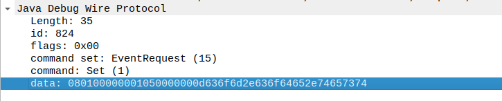
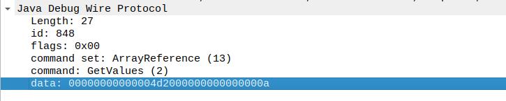
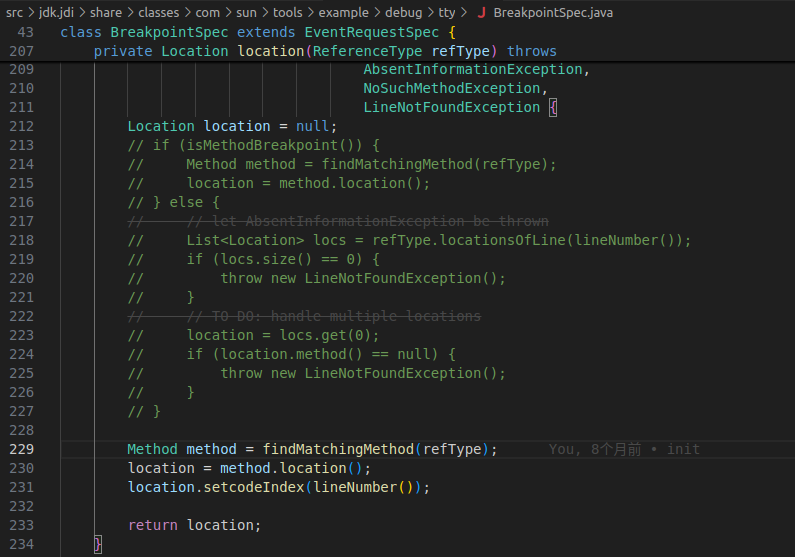
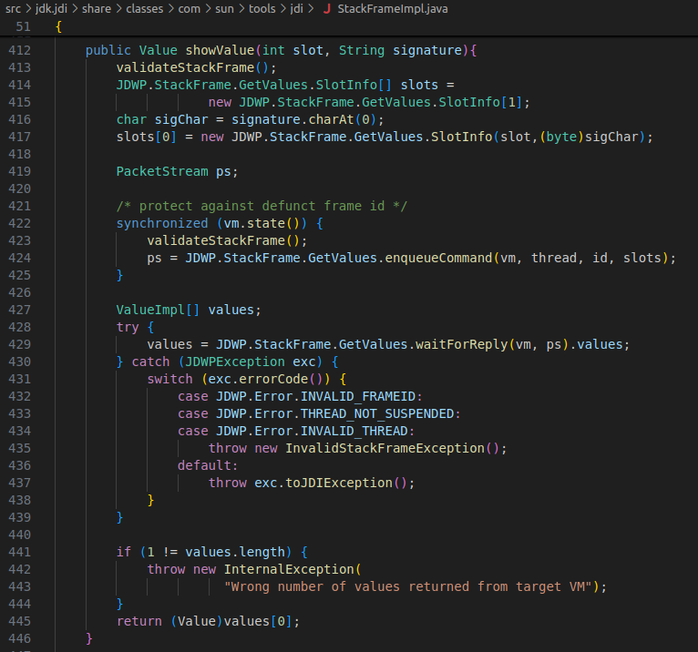
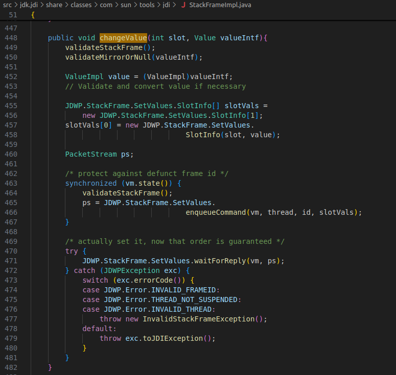
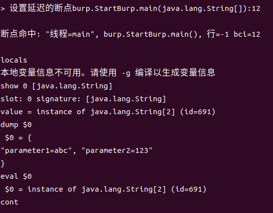

# Java字节码调试
## 前言
在对恶意Java应用程序进行分析时，反编译后阅读代码进行审计总是一个不错的选择。但随着各种混淆技术的普及以及反编译技术本身存在的一些缺陷，通过反编译代码进行静态分析的方式逐渐无法满足实际需求。在应用程序逻辑过于复杂，或应用程序被混淆、加固过的时候，使用动态调试的方式往往能更好更快地理清代码逻辑。但在混淆加固过后，Java应用程序已经丢失了调试信息，无法正常进行调试，需要借助一些工具补充调试信息。如[dirtyJOE](http://blog.rewolf.pl/blog/?p=786)或[apktool](https://bbs.kanxue.com/thread-195660.htm)都通过修改应用程序的方式，补充其中丢失的调试信息。

这类修改容易触发应用程序本身的防篡改检测，使用JVMTI对Java应用程序进行修改可以一定程度地避免该问题。但由于Java语言本身的特性，仅基于字节码也不能很好地判断变量类型、补充调试信息中的LocalVariableTable。

## 原理
Java应用程序的调试信息中对调试影响最大的是LineNumberTable和LocalVariableTable属性。LineNumberTable保存着字节码偏移量和Java源代码行号的对应关系。LocalVariableTable保存着帧栈中的局部变量与源码中定义的变量之间的关系。丢失LineNumberTable和LocalVariableTable后的应用程序也能使用调试工具进行调试，但无法正常地使用断点，也无法识别出局部变量。

在调试过程中，调试工具使用JDWP协议与被调试的进程进行通讯。查看调试过程中数据包，可以看到在调试过程中，设置断点是不需要使用源代码行号的。

读取局部变量也不依赖LocalVariableTable。

对Java字节码进行调试在协议层面上没有障碍，只是现有的调试工具无法支持。因此完全可以绕过调试工具的限制，直接通过JDWP协议对Java应用程序的字节码进行调试。

对Java应用程序的的字节码进行调试需要解决三个问题：
1. 获取对应Java应用程序的字节码
2. 在字节码中任意位置设置断点
3. 解析变量槽，识别帧栈中的局部变量

获取应用程序字节码可以使用JDK自带的javap和Android SDK自带的dexdumper。
## 实现
直接实现一个基于JDWP的Java调试工具是可行的，但基于JDB进行修改会更方便一点。
### 设置字节码断点
JDB在设置断点的过程依赖源代码行号，但最终会调用ReferenceType.locationsOfLine将行号转换为相对于对应的目标方法字节码的偏移量。只需要修改为直接传入相对字节码的偏移量即可。

### 变量槽处理
JDB中不存在直接处理帧栈中的局部变量的功能，调试时先从LocalVariableTable获取变量信息。因此需要手动实现局部变量的注册和修改功能。
调用JDWP协议读取局部变量信息：

调用JDWP协议修改局部变量内容：

## 效果
JDWP协议在Java的开发和调试中广泛使用，使用修改过的JDB可以直接对Java应用程序或Android Apk的字节码进行调试。如下，给main函数下断点并展示args的内容：

## 总结
如上，这是一个实现简单又非常有效的Java字节码调试方案，通过对JDB的少量修改就可以兼容不同的Java环境，对Java字节码进行调试。
